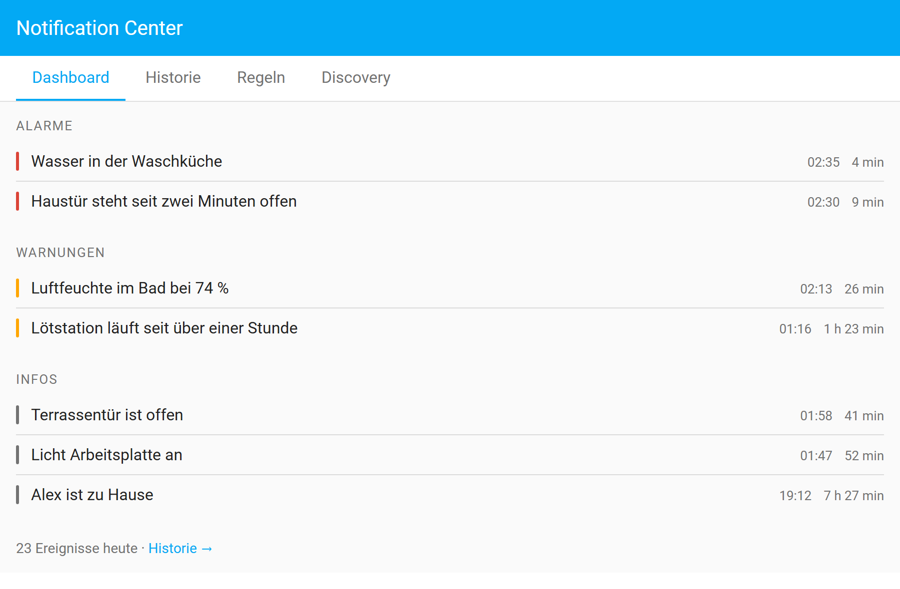
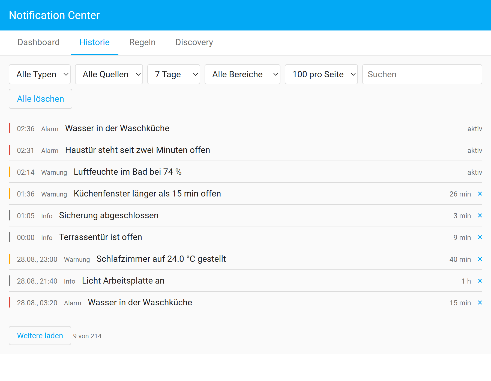
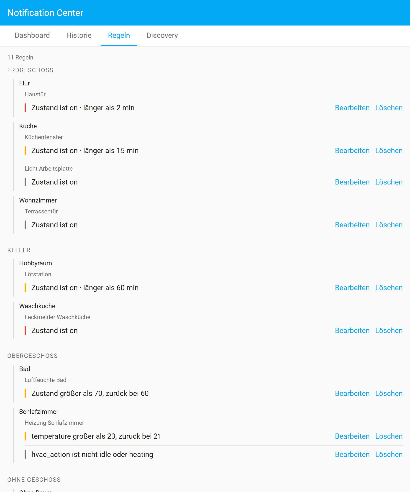
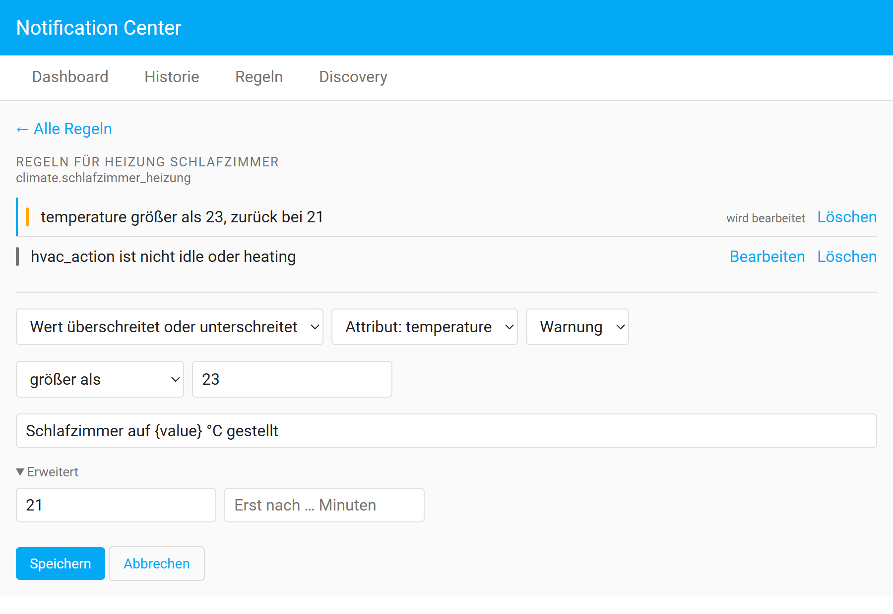
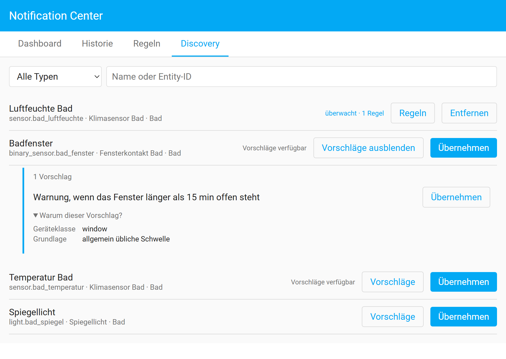
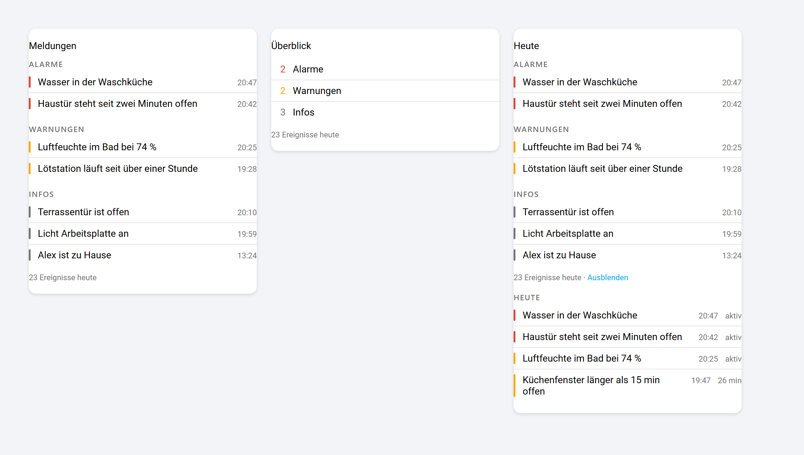

# Notification Center

Ein zentrales, lokales Benachrichtigungs- und Ereignissystem fuer Home Assistant: es ueberwacht ausgewaehlte Entities, erzeugt daraus zustandsgebundene Meldungen, fuehrt eine dauerhafte Historie und stellt Automationen eine eigene API bereit.

[](https://github.com/DaFlouw/notification_center/releases) [](https://github.com/DaFlouw/notification_center/stargazers) [](https://github.com/DaFlouw/notification_center/commits/main) [](https://hacs.xyz/) [](https://www.home-assistant.io/) [](LICENSE)



Es arbeitet ausschliesslich mit Daten der lokalen Home-Assistant-Instanz: keine externen Datenquellen, keine Cloud, keine externe Datenbank.

## Inhalt

**[`Installation`](#installation)**  **[`Einrichtung`](#einrichtung)**  **[`Das Panel`](#das-panel)**  **[`Regeln`](#regeln)**  **[`Regelgruppen`](#regelgruppen)**  **[`Lovelace-Card`](#lovelace-card)**  **[`Automations-API`](#automations-api)**  **[`Entities`](#entities)**  **[`Einstellungen`](#einstellungen)**  **[`Wie es arbeitet`](#wie-es-arbeitet)**  **[`Transparenz`](#transparenz)**  **[`Lizenz`](#lizenz)**

---

## Installation

**Niedrigste unterstuetzte Home-Assistant-Version:** 2026.8.0

<details>

<summary>Mit HACS (empfohlen)</summary>

<br>

So kommen Aktualisierungen ueber den Home Assistant Community Store zu dir. Jeder Versions-Tag erzeugt automatisch ein GitHub-Release, dem HACS folgt.

1. Ist HACS noch nicht installiert, folge der Anleitung auf [hacs.xyz](https://hacs.xyz/docs/use/download/download/)
2. In der Seitenleiste auf **HACS** gehen
3. Oben rechts auf die drei Punkte, dann auf **Benutzerdefinierte Repositories** — oder gleich den blauen Knopf unten benutzen
4. `DaFlouw/notification_center` eintragen, Kategorie **Integration**, auf **Hinzufuegen**
5. Nach *Notification Center* suchen und auf **Herunterladen**
6. Home Assistant **neu starten**
7. Weiter bei [Einrichtung](#einrichtung)

</details>

<details>

<summary>Ohne HACS</summary>

<br>

1. Das [aktuelle Release](https://github.com/DaFlouw/notification_center/releases/latest) als ZIP herunterladen
2. Den Ordner `custom_components/notification_center` daraus nach `<config>/custom_components/` kopieren, sodass `<config>/custom_components/notification_center/manifest.json` existiert
3. Home Assistant **neu starten**
4. Weiter bei [Einrichtung](#einrichtung)

Bei einer Aktualisierung den Ordner ersetzen und erneut neu starten. Konfiguration und Historie liegen ausserhalb dieses Ordners und bleiben dabei erhalten.

</details>

<br>

[](https://my.home-assistant.io/redirect/hacs_repository/?owner=DaFlouw&repository=notification_center&category=integration)

<br>

> [!IMPORTANT]
> Ein Neuladen der Integration genuegt nach einer Aktualisierung **nicht**. Home Assistant fuehrt den bereits geladenen Python-Code weiter aus, bis es neu startet. Ob die neue Fassung wirklich laeuft, verraet die Versionsangabe im Panel.

---

## Einrichtung

Nach dem Neustart unter *Einstellungen → Geraete & Dienste → Integration hinzufuegen* das **Notification Center** auswaehlen. Es gibt genau eine Instanz pro Installation.

[](https://my.home-assistant.io/redirect/config_flow_start/?domain=notification_center)

Danach erscheint **Notification Center** in der Seitenleiste. Beim ersten Aufruf fuehrt ein kurzer Assistent in die Discovery; er laesst sich ueberspringen und kommt dann nicht wieder.

---

## Das Panel

Vier Bereiche, erreichbar ueber die Reiter am Kopf.

### Dashboard

Zeigt ausschliesslich **aktive** Meldungen, gruppiert nach Alarmen, Warnungen und Infos, jeweils mit Text, Ausloeseuhrzeit und Laufzeit. Eine Meldung mit verknuepfter Entity ist anklickbar und oeffnet deren Detailansicht.


### Historie

Aktive und abgeschlossene Ereignisse, neueste zuerst. Filtern nach Typ, Quelle, Zeitraum und Bereich sowie die Volltextsuche laufen im Backend, nicht im Browser. Wie viele Eintraege eine Seite umfasst, waehlst du selbst: 50, 100 oder 200.



Aktive Meldungen tragen kein Loeschkreuz — sie enden ueber ihre Bedingung, nicht von Hand.

### Regeln

Der gesamte Regelbestand, nach Geschoss und Raum gruppiert, darunter eingerueckt die Entities. Was keinem Raum zugeordnet ist, sammelt sich am Ende.



Von hier fuehrt **Bearbeiten** in den Editor. Die Regel, deren Formular gerade offen ist, traegt statt des Knopfes den Vermerk *wird bearbeitet*.



> [!TIP]
> Die Entity-ID steht unter der Ueberschrift und im Dialog von *Entity ersetzen*. Das ist der Fall fuer einen Geraetetausch: die Regeln wandern mit und behalten ihre Kennungen.

### Discovery

Findet Entities nach Typ, Name oder Entity-ID und uebernimmt sie in die Ueberwachung. Zu vielen gibt es einen Regelvorschlag samt aufklappbarer Begruendung.



Vorschlaege, die bloss auf einem Wort im Namen beruhen, werden nicht angeboten: sie kosten mehr Vertrauen, als sie einbringen.

Neben Geraeten lassen sich auch **Helfer** ueberwachen — Schalter, Zahl, Auswahl, Text, Datum und Zeit, Zaehler, Timer und Zeitplan. Sie halten oft genau den Zustand, um den es beim Melden geht.

---

## Regeln

Eine Regel gehoert immer zu genau einer Entity. Als Wertquelle dient ihr Zustand oder eines ihrer Attribute.

| Bedingung | Wirkung |
|-----------|---------|
| **Zustand ist** | Gilt, solange der Zustand anliegt. |
| **Zustand ist nicht** | Gilt, solange der Zustand keiner der angegebenen ist. |
| **Zustand aendert sich zu** | Loest beim Wechsel in den Zielzustand aus und bleibt, solange dieser anliegt. |
| **Wert ueber- oder unterschreitet** | Numerischer Vergleich, wahlweise mit Hysterese. |

Dazu zwei Verfeinerungen, die sich mit jeder Bedingung kombinieren lassen:

| Feld | Wirkung |
|------|---------|
| **Rueckkehrschwelle** | Hysterese: die Meldung bleibt bestehen, bis der Wert diese Schwelle wieder passiert — nicht schon beim Unterschreiten der Ausloeseschwelle. |
| **Erst nach … Minuten** | Die Bedingung muss ununterbrochen so lange anliegen, bevor die Meldung entsteht. |

Im Meldungstext stehen Platzhalter zur Verfuegung:

| Platzhalter | Inhalt |
|-------------|--------|
| `{name}` | Anzeigename der Entity |
| `{state}` | aktueller Zustand |
| `{value}` | ausgewerteter Wert (Zustand oder Attribut) |
| `{unit}` | Einheit, sofern vorhanden |

Mehrere Regeln derselben Entity duerfen gleichzeitig gelten und erzeugen dann parallele Meldungen.

> [!NOTE]
> Entity-basierte Meldungen lassen sich nicht von Hand beenden. Sie enden, wenn ihre Bedingung nicht mehr gilt, ihre Regel geloescht oder ihre Entity aus der Ueberwachung genommen wird.

---

## Regelgruppen

Eine Regelgruppe buendelt mehrere numerische Regeln derselben Entity zu Eskalationsstufen. Sichtbar ist immer nur die hoechste erfuellte Stufe; jeder Stufenwechsel ist ein eigener Eintrag in der Historie.

```
Stufe 1  ab 40  Info
Stufe 2  ab 50  Warnung
Stufe 3  ab 60  Alarm
```

Jede Stufe fuehrt ihren eigenen Zustand mit, damit ihre Hysterese unabhaengig von den anderen arbeitet. Zustandsregeln bilden keine Gruppen: ohne Ordnung zwischen den Zustaenden laesst sich keine Eskalation definieren.

---

## Lovelace-Card

Die Card kommt mit der Integration und traegt sich selbst in die Lovelace-Ressourcen ein.



```yaml
type: custom:notification-center-card
mode: list             # list | counts, Vorgabe list
title: Meldungen       # optional
max: 10                # optional, hoechstens so viele je Kategorie
show_events_today: true
```

| Feld | Typ | Vorgabe | Bedeutung |
|------|-----|---------|-----------|
| `mode` | `list` \| `counts` | `list` | Einzelne Meldungen oder nur die Zahlen je Kategorie |
| `title` | Text | — | Ueberschrift der Karte |
| `max` | Zahl | — | Hoechstens so viele Meldungen je Kategorie |
| `show_events_today` | Boolean | `true` | Fusszeile mit den Ereignissen des Tages |

Das Aussehen laesst sich ueber CSS-Variablen anpassen, im Theme oder per `card_mod`; alle Bausteine tragen zusaetzlich einen `part`-Namen fuer `::part()`.

```yaml
--notification-center-alarm-color
--notification-center-warning-color
--notification-center-info-color
--notification-center-heading-color
--notification-center-heading-size
--notification-center-message-size
--notification-center-time-color
--notification-center-time-size
--notification-center-row-gap
--notification-center-row-padding
--notification-center-bar-width
--notification-center-card-padding
--notification-center-divider
```

> [!NOTE]
> Beim Neuladen der Integration bleibt der Ressourceneintrag der Card bestehen. Er gehoert zur Dashboard-Konfiguration; ihn zu entfernen wuerde jede bereits eingerichtete Karte zerstoeren.

---

## Automations-API

Drei Aktionen stehen Automationen zur Verfuegung. **Owner und ID bilden zusammen den eindeutigen Schluessel**; zwei Automationen duerfen dieselbe ID verwenden, ohne sich zu beeinflussen.

```yaml
# Erzeugen. Ein erneuter Aufruf mit demselben Schluessel ueberschreibt die
# bestehende Meldung, statt eine zweite anzulegen.
action: notification_center.create
data:
  notification_id: wasserleck
  type: alarm            # info | warning | alarm
  message: Wasserleck im Keller
  title: Keller          # optional
  entity_id: binary_sensor.leckmelder_keller   # optional, macht sie klickbar
  duration: "00:15:00"   # optional, beendet sie von selbst
```

```yaml
# Aendern. Erzeugt keinen eigenen Eintrag in der Historie.
action: notification_center.update
data:
  notification_id: wasserleck
  type: warning
  message: Wasserleck eingedaemmt
```

```yaml
# Beenden.
action: notification_center.dismiss
data:
  notification_id: wasserleck
```

Ohne `owner` wird die aufrufende Automation ueber den Aufrufkontext ermittelt. Das ist eine Naeherung; bei verschachtelten Skripten kann sie danebengehen. Wer sich auf saubere Trennung verlassen will, gibt `owner` ausdruecklich an.

Zusaetzlich feuert die Integration bei jedem Beginn, jeder Aenderung und jedem Ende ein Ereignis `notification_center_event` auf dem Home-Assistant-Eventbus.

---

## Entities

Fuenf Zaehler stehen als Sensoren bereit. Ihre Werte stammen aus dem laufenden Zustand, nicht aus einer Abfrage des Logs, und werden ereignisgesteuert fortgeschrieben.

| Entity | Bedeutung |
|--------|-----------|
| `sensor.notification_center_alarm_count` | aktive Alarme |
| `sensor.notification_center_warning_count` | aktive Warnungen |
| `sensor.notification_center_info_count` | aktive Infos |
| `sensor.notification_center_active_count` | aktive Meldungen gesamt |
| `sensor.notification_center_events_today` | Ereignisse seit Mitternacht |

---

## Einstellungen

Ueber *Konfigurieren* an der Integration:

| Einstellung | Werte | Bedeutung |
|-------------|-------|-----------|
| **Aufbewahrung der Historie** | 7, 30, 90, 365 Tage, unbegrenzt | Aelteres wird entfernt |
| **Maximale Anzahl Ereignisse** | 1.000, 5.000, 10.000, 50.000 | Aeltestes zuerst |
| **Analysezeitraum** | 1 bis 90 Tage | Wie weit die Historienanalyse zurueckblickt |
| **Pausiert** | an / aus | Waehrend der Pause entstehen keine neuen Meldungen |

Beide Aufbewahrungsgrenzen gelten gleichzeitig. Aktive Meldungen werden nie entfernt.

Waehrend einer Pause bleiben laufende Meldungen unberuehrt; beim Fortsetzen werden die aktuellen Zustaende neu bewertet. Gesichert wird alles vom Home-Assistant-Backup; eine eigene Sicherung gibt es bewusst nicht.

---

## Wie es arbeitet

Eine einzige Integration mit logisch getrennten Modulen. Die gesamte Geschaeftslogik liegt im Backend; das Frontend stellt dar und ruft die Backend-API auf.

```
custom_components/notification_center/
  api/            WebSocket-Kommandos und Services
  discovery/      Entity-Suche, Vorschlaege, Historienanalyse
  rules/          Regelmodelle, Auswertung, State-Listener
  notifications/  Modelle, Lebenszyklus, Engine
  storage/        Konfiguration (JSON) und Ereignisse (SQLite)
  frontend/       Panel und Card (buildfreie ES-Module)
```

**Persistenz.** Die Konfiguration liegt im Home-Assistant-Storage als JSON. Die Ereignisse liegen in einer eigenen SQLite-Datei unter `<config>/notification_center/events.db` — kein Datenbankserver, kein externer Dienst, und vom Home-Assistant-Backup mitgesichert. SQLite ist noetig, weil bis zu 50.000 Ereignisse mit serverseitigem Filtern, Suchen, Sortieren, Paginieren und Aufraeumen performant bleiben muessen.

**Leistung.** Die Ueberwachung ist vollstaendig ereignisbasiert: beobachtet werden nur die uebernommenen Entities, es gibt keine Schleife ueber alle Entities und kein Polling. Timer entstehen ausschliesslich fuer Regeln, deren Bedingung bereits anliegt. Die Zaehler werden fortgeschrieben und nie aus dem Log berechnet; nach einem Neustart kostet die Wiederherstellung zwei Abfragen.

Die Historienanalyse nutzt bevorzugt die Langzeitstatistiken von Home Assistant — bei sieben Tagen sind das hoechstens 168 Zeilen statt womoeglich Zehntausender Rohzustaende. Sie laeuft nur auf Anforderung, nie im Hintergrund; die Entitysuche fasst die Datenbank gar nicht an.

---

## Transparenz

Diese Integration wurde mit Unterstuetzung eines KI-Assistenten (Claude) entwickelt. Entwurf, Pruefung und Freigabe lagen beim Menschen.

Die Integration selbst enthaelt **keine** KI: sie wertet ausschliesslich Regeln aus, die du festlegst. Auch die Vorschlaege der Discovery entstehen aus Beschreibungsdaten und klassischer Statistik (Quantile, Interquartilsabstand) — kein Modell, kein Training, keine Inferenz. Es werden keine Daten an Dritte uebertragen.

Damit greifen die Transparenzpflichten aus Artikel 50 der KI-Verordnung (EU) 2024/1689 hier nicht: sie gelten fuer KI-Systeme, waehrend regelbasierte Software ausdruecklich ausgenommen ist. Der Data Act (EU) 2023/2854 enthaelt keine Kennzeichnungspflicht fuer KI. Dieser Absatz ordnet ein und ist keine Rechtsberatung.

---

## Lizenz

MIT, siehe [LICENSE](LICENSE).
