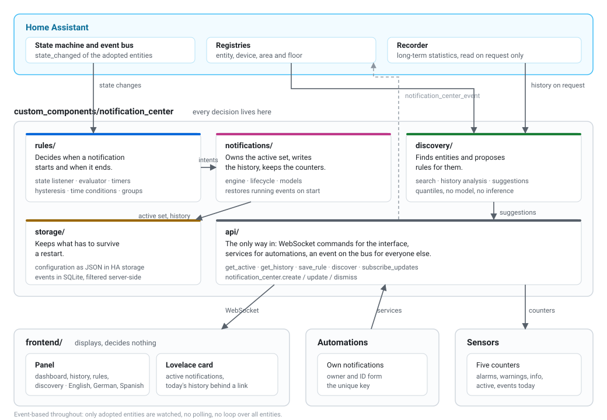

# Notification Center

***English** · [Deutsch](README.de.md)*

A central, local notification and event system for Home Assistant: it watches the entities you choose, turns them into state-bound notifications, keeps a durable history, and gives automations an API of their own.

[](https://github.com/DaFlouw/notification_center/releases) [](https://github.com/DaFlouw/notification_center/stargazers) [](https://github.com/DaFlouw/notification_center/commits/main) [](https://hacs.xyz/) [](https://www.home-assistant.io/) [](LICENSE)


It works entirely on data from your local Home Assistant instance: no external data sources, no cloud, no external database.

## Contents

**[`Installation`](#installation)**  **[`Setup`](#setup)**  **[`The panel`](#the-panel)**  **[`Rules`](#rules)**  **[`Rule groups`](#rule-groups)**  **[`Lovelace card`](#lovelace-card)**  **[`Automation API`](#automation-api)**  **[`Entities`](#entities)**  **[`Settings`](#settings)**  **[`How it works`](#how-it-works)**  **[`Languages`](#languages)**  **[`Transparency`](#transparency)**  **[`License`](#license)**

---

## Installation

**Minimum supported Home Assistant version:** 2026.8.0

<details>

<summary>With HACS (recommended)</summary>

<br>

This is how updates reach you, through the Home Assistant Community Store. Every version tag creates a GitHub release automatically, and HACS follows it.

1. If HACS is not installed yet, follow the guide at [hacs.xyz](https://hacs.xyz/docs/use/download/download/)
2. Open **HACS** in the sidebar
3. Top right, the three dots, then **Custom repositories** — or use the blue button below right away
4. Enter `DaFlouw/notification_center`, category **Integration**, then **Add**
5. Search for *Notification Center* and click **Download**
6. **Restart** Home Assistant
7. Continue at [Setup](#setup)

</details>

<details>

<summary>Without HACS</summary>

<br>

1. Download the [latest release](https://github.com/DaFlouw/notification_center/releases/latest) as a ZIP
2. Copy the folder `custom_components/notification_center` from it into `<config>/custom_components/`, so that `<config>/custom_components/notification_center/manifest.json` exists
3. **Restart** Home Assistant
4. Continue at [Setup](#setup)

To update, replace the folder and restart again. Configuration and history live outside that folder and are kept.

</details>

<br>

[](https://my.home-assistant.io/redirect/hacs_repository/?owner=DaFlouw&repository=notification_center&category=integration)

<br>

> [!IMPORTANT]
> Reloading the integration after an update is **not** enough. Home Assistant keeps running the Python code it already loaded until it restarts. The version shown in the panel tells you which one is really running.

---

## Setup

After the restart, go to *Settings → Devices & Services → Add integration* and pick **Notification Center**. There is exactly one instance per installation.

[](https://my.home-assistant.io/redirect/config_flow_start/?domain=notification_center)

**Notification Center** then appears in the sidebar. On first use a short assistant leads into Discovery; it can be skipped and will not come back.

---

## The panel

Four areas, reachable through the tabs at the top.

### Dashboard

Shows **active** notifications only, grouped into alarms, warnings and info, each with its text, the time it started and how long it has been running. A notification with a linked entity is clickable and opens its more-info dialog.


### History

Active and closed events, newest first. Filtering by type, source, period and area, as well as full-text search, run in the backend rather than in the browser. You choose how many entries a page holds: 50, 100 or 200.


Active notifications carry no delete cross — they end through their condition, not by hand.

### Rules

Every rule you have, grouped by floor and area, with the entities indented underneath. Anything without an area collects at the end.


**Edit** leads into the editor. The rule whose form is currently open shows the note *being edited* instead of the button.


> [!TIP]
> The entity ID sits under the heading and in the *Replace entity* dialog. That is the case for swapping a device: the rules move along and keep their identifiers.

### Discovery

Finds entities by type, name or entity ID and takes them into monitoring. Many come with a rule suggestion and a reason you can unfold.


Suggestions that rest on nothing but a word in the name are not offered: they cost more trust than they earn.

Besides devices you can watch **helpers** too — toggle, number, dropdown, text, date and time, counter, timer and schedule. They often hold exactly the state a notification is about.

Anything carrying a state that holds and falls away again can be watched: sensors and binary sensors, covers and valves, locks, climate and water heaters, vacuums and lawn mowers, switches, lights, fans, humidifiers, sirens, media players, remotes, presence and persons, alarm panels, updates, and the number, selection, text, date, time and to-do entities an integration provides. Buttons and events are left out on purpose: their state is the moment they last fired, so no condition on them could ever hold or end.

---

## Rules

A rule always belongs to exactly one entity. Its value comes from that entity's state or from one of its attributes.

| Condition | Effect |
|-----------|--------|
| **State is** | Holds while the state is present. |
| **State is not** | Holds while the state is none of the given ones. |
| **State changes to** | Triggers on the change into the target state and stays while that state is present. |
| **Value goes above or below** | Numeric comparison, optionally with hysteresis. |

Two refinements can be combined with any condition:

| Field | Effect |
|-------|--------|
| **Release threshold** | Hysteresis: the notification stays until the value passes this threshold again — not already when it falls back past the trigger threshold. |
| **Only after … minutes** | The condition has to hold without interruption for that long before the notification appears. |

Placeholders are available in the message:

| Placeholder | Content |
|-------------|---------|
| `{name}` | display name of the entity |
| `{state}` | current state |
| `{value}` | evaluated value (state or attribute) |
| `{unit}` | unit, where there is one |

Several rules on the same entity may hold at once and then produce parallel notifications.

> [!NOTE]
> Entity-based notifications cannot be dismissed by hand. They end when their condition no longer holds, when their rule is deleted, or when their entity is removed from monitoring.

---

## Rule groups

A rule group bundles several numeric rules of the same entity into escalation levels. Only the highest level that holds is visible; every change of level is its own entry in the history.

```
Level 1  from 40  Info
Level 2  from 50  Warning
Level 3  from 60  Alarm
```

Each level carries its own state so that its hysteresis works independently of the others. State rules form no groups: without an order between states there is no escalation to define.

---

## Lovelace card

The card ships with the integration and registers itself as a Lovelace resource.


```yaml
type: custom:notification-center-card
mode: list             # list | counts, default list
title: Notifications   # optional
max: 10                # optional, at most this many per category
show_events_today: true
show_history: false    # optional, a link to today's events
history_max: 5         # optional, at most this many of them
```

| Field | Type | Default | Meaning |
|-------|------|---------|---------|
| `mode` | `list` \| `counts` | `list` | Individual notifications, or just the numbers per category |
| `title` | text | — | Heading of the card |
| `max` | number | — | At most this many notifications per category |
| `show_events_today` | boolean | `true` | Footer with the number of events today |
| `show_history` | boolean | `false` | Adds a link in the footer that unfolds today's events, closed ones included |
| `history_max` | number | `5` | At most this many entries behind that link |

### Today's history

The card itself shows what is **active** right now. What already happened today sits behind a link, the same way the panel's dashboard links to its history:

```yaml
type: custom:notification-center-card
show_history: true
history_max: 5
```

The footer then reads *23 events today · Today →*. One click unfolds the list, another hides it again. It shows closed events too — that is the point of looking back at the day — each with its time and how long it lasted; still running ones are marked as active. A row with a linked entity opens that entity, just like the rows above it.

Nothing is fetched until you use the link: folded up, the card asks the backend for nothing and takes no more room than before. While it is open, the list is refreshed whenever something changes. The day starts at midnight in the timezone of the browser, so "today" means today, not the last 24 hours.

> [!NOTE]
> `history_max` only limits what the card displays. The full history stays in the panel, with filters, search and paging.

The looks can be adjusted through CSS variables, in a theme or with `card_mod`; every building block also carries a `part` name for `::part()`.

```yaml
--notification-center-alarm-color
--notification-center-warning-color
--notification-center-info-color
--notification-center-heading-color
--notification-center-heading-size
--notification-center-message-size
--notification-center-time-color
--notification-center-time-size
--notification-center-row-gap
--notification-center-row-padding
--notification-center-bar-width
--notification-center-card-padding
--notification-center-divider
```

> [!NOTE]
> Reloading the integration keeps the card's resource entry. It belongs to the dashboard configuration; removing it would break every card already placed.

---

## Automation API

Three actions are available to automations. **Owner and ID together form the unique key**; two automations may use the same ID without affecting each other.

```yaml
# Create. Calling again with the same key overwrites the existing
# notification instead of adding a second one.
action: notification_center.create
data:
  notification_id: water_leak
  type: alarm            # info | warning | alarm
  message: Water leak in the basement
  title: Basement        # optional
  entity_id: binary_sensor.leak_basement   # optional, makes it clickable
  duration: "00:15:00"   # optional, ends it by itself
```

```yaml
# Update. Does not create an entry of its own in the history.
action: notification_center.update
data:
  notification_id: water_leak
  type: warning
  message: Water leak contained
```

```yaml
# Dismiss.
action: notification_center.dismiss
data:
  notification_id: water_leak
```

Without `owner`, the calling automation is derived from the call context. That is an approximation; with nested scripts it can miss. If you rely on clean separation, state `owner` explicitly.

The integration also fires a `notification_center_event` on the Home Assistant event bus for every start, change and end.

---

## Entities

Five counters are available as sensors. Their values come from the running state rather than from a query against the log, and they are written forward as events happen.

| Entity | Meaning |
|--------|---------|
| `sensor.notification_center_alarm_count` | active alarms |
| `sensor.notification_center_warning_count` | active warnings |
| `sensor.notification_center_info_count` | active info notifications |
| `sensor.notification_center_active_count` | active notifications in total |
| `sensor.notification_center_events_today` | events since midnight |

---

## Settings

Through *Configure* on the integration:

| Setting | Values | Meaning |
|---------|--------|---------|
| **History retention** | 7, 30, 90, 365 days, unlimited | Older entries are removed |
| **Maximum number of events** | 1,000, 5,000, 10,000, 50,000 | Oldest first |
| **Analysis period** | 1 to 90 days | How far the history analysis looks back |
| **Paused** | on / off | While paused, no new notifications appear |

Both retention limits apply at the same time. Active notifications are never removed.

While paused, running notifications stay untouched; on resume the current states are evaluated again. Everything is covered by the Home Assistant backup; there is deliberately no backup of its own.

---

## How it works

A single integration with logically separated modules. All business logic lives in the backend; the frontend displays and calls the backend API.



```
custom_components/notification_center/
  api/            WebSocket commands and services
  discovery/      entity search, suggestions, history analysis
  rules/          rule models, evaluation, state listener
  notifications/  models, lifecycle, engine
  storage/        configuration (JSON) and events (SQLite)
  frontend/       panel and card (build-free ES modules)
```

**Persistence.** The configuration lives in Home Assistant storage as JSON. The events live in an SQLite file of their own under `<config>/notification_center/events.db` — no database server, no external service, and included in the Home Assistant backup. SQLite is needed because up to 50,000 events have to stay fast with server-side filtering, searching, sorting, paging and cleanup.

**Performance.** Monitoring is fully event-based: only the adopted entities are watched, there is no loop over all entities and no polling. Timers exist only for rules whose condition already holds. The counters are written forward and never computed from the log; after a restart, recovery costs two queries.

The history analysis prefers Home Assistant's long-term statistics — for seven days that is at most 168 rows instead of possibly tens of thousands of raw states. It runs only on request, never in the background; the entity search does not touch the database at all.

---

## Languages

The interface speaks **English**, **German** and **Spanish**. It follows the language Home Assistant reports for the signed-in user; a regional variant such as `de-CH` falls back to `de`, anything else to English. The notifications themselves stay exactly as your rules wrote them.

Translated are the panel and the card, the integration's texts inside Home Assistant, and the suggestions from Discovery.

<details>

<summary>Adding a language</summary>

<br>

Three places, one file each:

1. Create `custom_components/notification_center/frontend/translations/<code>.js` — a copy of `en.js` is the easiest start — and register it in `SPRACHEN` in `frontend/i18n.js`.
2. Add an entry to `TEXTE` in `custom_components/notification_center/discovery/texte.py`; those are the texts of the suggestions.
3. Create `custom_components/notification_center/translations/<code>.json`, modelled on `en.json`; that is the setup inside Home Assistant.

Missing keys are allowed: they fall back to English. The tests check that no language brings unknown keys along and that the placeholders match.

</details>

---

## Transparency

This integration was developed with the help of an AI assistant (Claude). Design, review and release were with a human.

The integration itself contains **no** AI: it evaluates the rules you set, nothing else. The Discovery suggestions, too, come from descriptive metadata and classical statistics (quantiles, interquartile range) — no model, no training, no inference. No data is transferred to third parties.

The transparency obligations of Article 50 of the AI Act (EU) 2024/1689 therefore do not apply here: they cover AI systems, while rule-based software is explicitly excluded. The Data Act (EU) 2023/2854 contains no labelling duty for AI. This paragraph gives context and is not legal advice.

---

## License

MIT, see [LICENSE](LICENSE).
